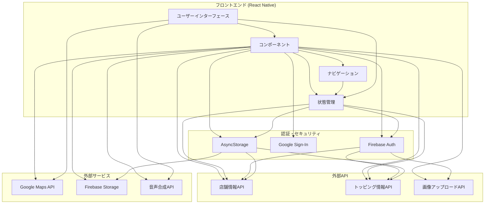
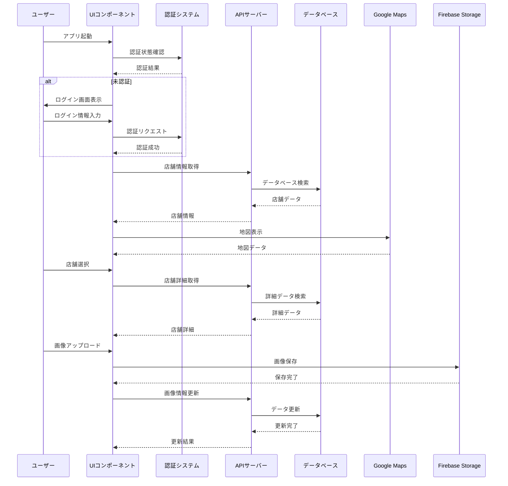

# J-Navi（二郎・二郎系情報アプリ）


<div align="center">
  
</div>

## 概要

J-Navi は、ラーメン二郎および二郎系ラーメン店の情報を提供するモバイルアプリです。店舗の位置情報、営業時間、トッピング・コール情報を簡単に確認できます。React Native と Expo を使用して開発された、iOS と Android の両プラットフォームに対応したクロスプラットフォームアプリケーションです。

## 機能・機能の説明

### 主要機能

#### 🗺️ **店舗マップ機能**

- **現在地表示**: GPS を使用してユーザーの現在位置を地図上に表示
- **店舗マーカー**: 登録された二郎系店舗を地図上にマーカーで表示
- **店舗情報表示**: マーカーをタップすると店舗の詳細情報をボトムシートで表示
- **店舗検索**: 店舗名や地域での検索機能

#### 🏪 **店舗情報管理**

- **店舗登録**: 新規店舗情報の登録（店舗名、支店名、住所、営業時間等）
- **店舗編集**: 既存店舗情報の更新
- **画像アップロード**: 店舗の外観や内装写真のアップロード機能
- **営業状況**: 営業時間、定休日、臨時休業情報の管理

#### 🍜 **トッピング・コール情報**

- **事前コール**: 食券購入時の事前コールオプション管理
- **着丼前コール**: ラーメン完成時のトッピングコールオプション管理
- **コール詳細**: 各店舗のコール方法やトッピングの詳細情報

#### 🎮 **コールシミュレーション**

- **券売機シミュレーション**: 店舗選択とメニュー選択機能
- **事前コールシミュレーション**: 食券購入時のコール練習
- **着丼前コールシミュレーション**: ラーメン完成時のコール練習
- **音声合成**: コール内容の音声再生機能

#### 🔐 **認証機能**

- **メール認証**: メールアドレスとパスワードによる認証
- **Google 認証**: Google アカウントを使用したソーシャルログイン
- **ユーザー管理**: ログイン状態に応じた機能制限

#### 🎤 **音声機能**

- **音声入力**: 音声によるテキスト入力機能
- **音声合成**: テキストの音声読み上げ機能
- **コール練習**: 実際の店舗でのコール練習支援

### 画面構成

```
📱 J-Navi アプリ画面構成
├── 🗺️ 店舗マップ画面 (メイン画面)
├── 🏪 店舗管理
│   ├── 📝 店舗登録画面
│   ├── ✏️ 店舗編集画面
│   ├── 📸 画像アップロード画面
│   └── 📋 店舗詳細画面
├── 🎮 シミュレーション
│   ├── 🎫 券売機画面
│   ├── 📞 事前コール画面
│   ├── 🍜 着丼前コール画面
│   └── ✅ 完了画面
└── 🔐 認証
    ├── 📝 サインアップ画面
    └── 🔑 サインイン画面
```

## 技術スタック

<div align="center">
  
  
  
  
  
</div>

### フレームワーク・言語

- **React Native**: 0.76.9 - クロスプラットフォームモバイルアプリ開発
- **TypeScript**: 5.3.3 - 型安全な JavaScript 開発
- **Expo**: 52.0.47 - React Native 開発プラットフォーム

### 主要ライブラリ

#### UI・コンポーネント

- **React Native Paper**: 5.13.1 - Material Design 準拠の UI コンポーネント
- **React Native Maps**: 1.18.0 - 地図表示機能
- **@gorhom/bottom-sheet**: 5.1.2 - ボトムシート UI
- **React Native Reanimated**: 3.16.1 - アニメーション
- **React Native Gesture Handler**: 2.20.2 - ジェスチャー処理

#### 状態管理・フォーム

- **React Hook Form**: 7.54.2 - フォーム管理
- **@react-native-async-storage/async-storage**: 1.23.1 - ローカルストレージ

#### 認証・バックエンド連携

- **@react-native-firebase/app**: 22.4.0 - Firebase SDK
- **@react-native-firebase/auth**: 22.4.0 - Firebase 認証
- **@react-native-google-signin/google-signin**: 13.2.0 - Google 認証
- **Axios**: 1.11.0 - HTTP 通信

#### 画像・メディア

- **Expo Image Picker**: 16.0.6 - 画像選択
- **Expo Image Manipulator**: 13.0.6 - 画像編集
- **Expo Image**: 2.0.7 - 画像表示

#### 音声・位置情報

- **Expo Speech**: 13.0.1 - 音声合成
- **Expo Location**: 18.0.10 - 位置情報取得

#### 開発ツール

- **ESLint**: 9.21.0 - コード品質管理
- **TypeScript ESLint**: 8.26.0 - TypeScript 用 ESLint

### アーキテクチャ

- **Expo Router**: 4.0.20 - ファイルベースルーティング
- **Context API**: React 18.3.1 - 状態管理
- **Singleton Pattern**: API クライアントの実装

## システム構成図



## データフロー図



## 環境変数

プロジェクトで使用する環境変数は以下の通りです。`.env`ファイルを作成して適切な値を設定してください。

### 必須環境変数

| 変数名                            | 説明                          | 例                      |
| --------------------------------- | ----------------------------- | ----------------------- |
| `EXPO_PUBLIC_API_URL`             | バックエンド API のベース URL | `https://api.jnavi.com` |
| `GOOGLE_MAPS_API_KEY`             | Google Maps API キー（ビルド時のみ・`EXPO_PUBLIC_` なし） | `AIzaSyC...`            |

### Firebase 設定（必須）

| 変数名                                     | 説明                         | 例                           |
| ------------------------------------------ | ---------------------------- | ---------------------------- |
| `EXPO_PUBLIC_FIREBASE_API_KEY`             | Firebase API キー            | `AIzaSyC...`                 |
| `EXPO_PUBLIC_FIREBASE_AUTH_DOMAIN`         | Firebase 認証ドメイン        | `project.firebaseapp.com`    |
| `EXPO_PUBLIC_FIREBASE_PROJECT_ID`          | Firebase プロジェクト ID     | `jnavi-project`              |
| `EXPO_PUBLIC_FIREBASE_MESSAGING_SENDER_ID` | Firebase メッセージ送信者 ID | `123456789`                  |
| `EXPO_PUBLIC_FIREBASE_WEB_APP_ID`          | Firebase Web アプリ ID       | `1:123456789:web:abc123`     |
| `EXPO_PUBLIC_FIREBASE_ANDROID_APP_ID`      | Firebase Android アプリ ID   | `1:123456789:android:abc123` |
| `EXPO_PUBLIC_FIREBASE_IOS_APP_ID`          | Firebase iOS アプリ ID       | `1:123456789:ios:abc123`     |

### Google 認証設定（必須）

| 変数名                                 | 説明                                  | 例              |
| -------------------------------------- | ------------------------------------- | --------------- |
| `EXPO_PUBLIC_GOOGLE_WEB_CLIENT_ID`     | Google 認証用 Web クライアント ID     | `123456789-...` |
| `EXPO_PUBLIC_GOOGLE_IOS_CLIENT_ID`     | Google 認証用 iOS クライアント ID     | `123456789-...` |
| `EXPO_PUBLIC_GOOGLE_ANDROID_CLIENT_ID` | Google 認証用 Android クライアント ID | `123456789-...` |

### オプション環境変数

| 変数名                       | 説明                                 | デフォルト値                 |
| ---------------------------- | ------------------------------------ | ---------------------------- |
| `GOOGLE_SERVICES_JSON`       | Android 用 Firebase 設定ファイルパス | `./google-services.json`     |
| `GOOGLE_SERVICES_INFO_PLIST` | iOS 用 Firebase 設定ファイルパス     | `./GoogleService-Info.plist` |

### 環境変数設定例

```bash
# .env ファイルの例
EXPO_PUBLIC_API_URL=https://api.jnavi.com
GOOGLE_MAPS_API_KEY=AIzaSyC...

# Firebase 設定
EXPO_PUBLIC_FIREBASE_API_KEY=AIzaSyC...
EXPO_PUBLIC_FIREBASE_AUTH_DOMAIN=jnavi-project.firebaseapp.com
EXPO_PUBLIC_FIREBASE_PROJECT_ID=jnavi-project
EXPO_PUBLIC_FIREBASE_MESSAGING_SENDER_ID=123456789
EXPO_PUBLIC_FIREBASE_WEB_APP_ID=1:123456789:web:abc123
EXPO_PUBLIC_FIREBASE_ANDROID_APP_ID=1:123456789:android:abc123
EXPO_PUBLIC_FIREBASE_IOS_APP_ID=1:123456789:ios:abc123

# Google 認証設定
EXPO_PUBLIC_GOOGLE_WEB_CLIENT_ID=123456789-...
EXPO_PUBLIC_GOOGLE_IOS_CLIENT_ID=123456789-...
EXPO_PUBLIC_GOOGLE_ANDROID_CLIENT_ID=123456789-...

# オプション設定
GOOGLE_SERVICES_JSON=./google-services.json
GOOGLE_SERVICES_INFO_PLIST=./GoogleService-Info.plist
```

## インストールと実行手順

### 前提条件

- Node.js（バージョン 22.13.0 以上）
- npm
- Expo CLI
- iOS 開発の場合: Xcode 15 以上
- Android 開発の場合: Android Studio と SDK

### インストール手順

1. リポジトリをクローンします。

   ```sh
   git clone https://github.com/yourusername/jnavi.git
   cd jnavi
   ```

2. 依存関係をインストールします。

   ```sh
   npm install
   # または
   yarn install
   ```

3. 環境変数ファイルを設定します。`.env.example` をコピーして `.env` を作成し、必要な API キーなどを設定します。

   ```sh
   cp .env.example .env
   # その後、.envファイルを編集して必要な環境変数を設定
   ```

4. Expo CLI をインストールしていない場合は、以下のコマンドでインストールします。

   ```sh
   npm install -g expo-cli
   ```

### 実行手順

1. 開発サーバーを起動します。

   ```sh
   npx expo start
   ```

2. 表示された QR コードを Expo Go アプリ（iOS/Android）でスキャンしてアプリを実行します。

3. iOS シミュレータで実行する場合:

   ```sh
   npx expo start --ios
   ```

4. Android エミュレータで実行する場合:

   ```sh
   npx expo start --android
   ```

5. Expo Dev Client を使用して実行する場合:

   ```sh
   npx expo start --dev-client
   ```

## 開発ガイドライン

### コーディング規約

- TypeScript の型定義を徹底し、`any` 型の使用を避ける
- コンポーネントはできるだけ小さく、再利用可能に設計する
- React Native Paper のコンポーネントを優先的に使用する
- 状態管理には Context API を活用する
- 非同期処理では async/await 構文を使用する

### プロジェクト構成

```plaintext
src/
├── components/       # 再利用可能なUI要素
├── screens/          # アプリの各画面
├── navigation/       # ナビゲーション関連
├── services/         # API通信などのサービス
├── hooks/            # カスタムフック
├── contexts/         # Contextを使った状態管理
├── utils/            # ユーティリティ関数
├── types/            # TypeScript型定義
└── assets/           # 画像などの静的リソース
```

## ビルド手順

### 開発ビルド

```sh
eas build --profile development --platform all
```

### プレビュー用ビルド

```sh
eas build --profile preview --platform all
```

### 本番ビルド

```sh
eas build --profile production --platform all
```

## デプロイ手順

### 本番環境へのデプロイ

```sh
eas submit --profile production --platform all
```

### iOS App Store へのデプロイ

```sh
eas submit --platform ios
```

### Google Play Store へのデプロイ

```sh
eas submit --platform android
```

## 貢献ガイドライン

1. 既存のイシューを確認するか、新しいイシューを作成する
2. フォークしてブランチを作成する（`feature/機能名` または `fix/問題名`）
3. コードを変更し、コミットする
4. テストが通ることを確認する
5. プルリクエストを作成する

## トラブルシューティング

- **ビルドエラー**: `node_modules` を削除して再インストールを試す
- **iOS シミュレータの問題**: `npx expo start --clear` でキャッシュをクリアする
- **Android エミュレータの問題**: AVD マネージャーからエミュレータを再起動する
- **Firebase 接続エラー**: `.env` ファイルの API キーを確認する

## ライセンス

このプロジェクトは **MIT ライセンス** の下で公開されています。

### MIT ライセンスの内容

MIT ライセンスは、以下の権利を提供します：

- **商用利用**: 商用目的での使用が可能
- **修正**: ソースコードの修正が可能
- **配布**: 修正版の配布が可能
- **個人利用**: 個人での使用が可能

### 制限事項

- **著作権表示**: 元の著作権表示を保持する必要があります
- **免責事項**: 作者は一切の責任を負いません

詳細なライセンス内容については、プロジェクトルートの `LICENSE` ファイルを参照してください。

## 連絡先

質問や提案がある場合は、Issues セクションで新しいイシューを作成するか、プロジェクト管理者にメールでお問い合わせください。
